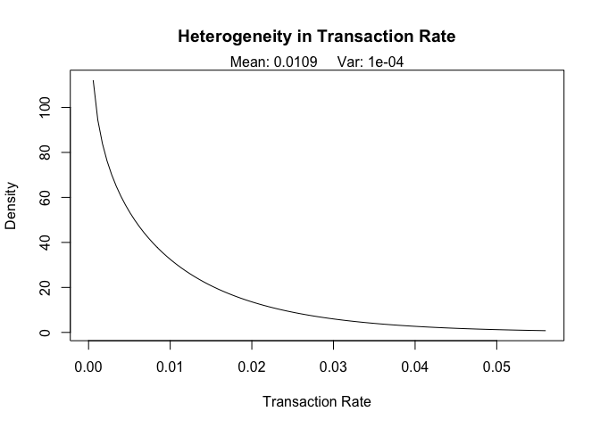
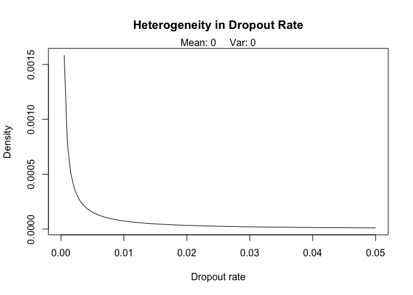
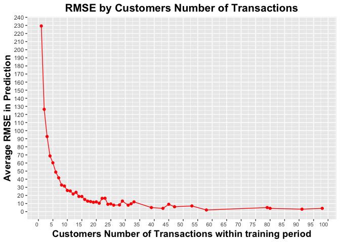

Predicting Time Until Next Order
================

### Goal

The goal is to **build a predictive model to explain time until next order** for an online retail store.

What can it be useful for?

-   *(i)* Customer care queuing, *(ii)* demand forecasting, *(iii)* model customers' CLV and *(iii)* as proxy for a company's value/stock price, among many others. In fact, the availability of transactional and behavioral data can allow us to accurately identify top customers and forecast their behaviors and better understand the features and traits associated with valuable customers.

### Data Set

We will work with a sample of transaction level data of a UK-based and registered non-store online retailer. The company mainly sells unique all-occasion gifts. Many customers of the company are wholesalers. Data span the period between 2010-12-01 and 2011-12-09 and stem from the UCI Machine Learning Repository (publicly available).

Find its attribute information below:

-   **InvoiceNo**: Invoice number. *Nominal*. 6-digit integral number uniquely assigned to each transaction. If this code starts with letter 'c', it indicates a cancellation.

-   **StockCode**: Product (item) code. *Nominal*. 5-digit integral number uniquely assigned to each distinct product.

-   **Description**: Product (item) name. *Nominal*.

-   **Quantity**: The quantities of each product (item) per transaction. *Numeric*.

-   **InvoiceDate**: Invoice Date and time. *Numeric*. Day and time when each transaction was generated.

-   **UnitPrice**: Unit price. *Numeric*. Product price per unit in sterling.

-   **CustomerID**: Customer number. *Nominal*. 5-digit integral number uniquely assigned to each customer.

-   **Country**: Country name. *Nominal*. Name of the country where each customer resides.

### Model Choice

To approach the task of predicting **time until next order** we will use a model called Pareto/NBD. This is a Bayesian model which fits the business’s data we are about to work with since it's designed for *non-contractual & continuous situations* in which customers can make purchases at any time.

The R library which implements it is called BTYD (a.k.a. *Buy 'Til You Die*).

``` r
library(BTYD)
```

### Intuition Behind the Model

Intuitively, we assume that we can define every customer with two independent parameters: *(i)* Their **purchasing rate** (*purchases/time*) and *(ii)* their **lifetime** as an active customer. By getting to knowing these two parameters, we can then easily infer when to expect their next order, and what's their likelihood of still being alive.

How does this translate into probability terms?

-   First, while active, we assume that the number of transactions made by a customer in a time period of length t follows a **Poisson distribution** with purchasing rate **λ**. And second, the point at which the customer becomes inactive we assume is **distributed exponentially** with lifetime **μ**.

How do we estimate *λ* and *μ* on every customer?

-   Similarly to any other Bayesian model, Pareto/NBD will first estimate the heterogeneity in transaction rates and lifetimes across all customers. In Bayesian terms, this will be our prior believe on how the latent parameters λ and μ are distributed within the customer population. More specifically, we assume that heterogeneity in transaction rates across customers follows a **gamma distribution** with shape parameter **r** and scale parameter **alpha**, and heterogeneity in lifetimes across customers follows a **gamma distribution** with shape parameter **s** and scale parameter **beta**.

-   When the prior distributions are estimated, we can then **apply the Bayes Theorem** and predict **conditionally** λ and μ on every individual customer **given their historical behavior**. That will result in the best estimate of the two parameters that define our customers on an individual level. Note that gamma distribution is a conjugate prior to Poisson and exponential likelihoods which makes calculations fairly easier.

### Model Limitations

With such model, besides predicting time until next order, we can extract actionable information such as the probability of a customer being alive at a given time or the number of potential transactions made by a customer during a specific period of time. In addition, it would take little effort to add a layer to the model to predict revenue of next order by implementing a gamma-gamma spend model (which is already implemented in the BTYD library).

However, what are the limitations of a probabilistic model?

1.  The model is only usable for customers who have made at least one purchase. Additionally, one needs at least a period of 3 times the mean inter-purchase-time (IPT) to make accurate predictions. Recent cohorts will result in inaccurate predictions.

2.  The latent parameters with which we characterize customer behaviors (λ, μ) are assumed to be stationary.

3.  The model does not take into account customer information which we typically have. A potential approach to overcome this may be to segment/cluster customers accordingly, and after that, build a model for each of the resulting segments.

### Customer Features we Need

To estimate every customer's *λ* and *μ*, Pareto/NBD is concerned with the following three features: *(i)* How many transactions they made in the calibration period (frequency), *(ii)* the time of their last transaction (recency), and *(iii)* the total time they have been observed for. These three features will help us inferring the following two latent parameters on a customer level at a given point in time.

### Data Pre-processing

First, we get rid of transaction descriptions and their stock code. Second, we delete all transaction with unidentified customers (NA in 'CustomerID' column) as they cannot be imputed by means of any other rows/columns in the dataset. Finally, we will only dismiss rows of cancelled orders even though it is discussable whether their equivalent original orders should also be dismissed.

``` r
# Load the data to a data.frame
UKretail <- read.csv('UKretail.csv')

# Remove 'Description' column
UKretail <- subset(UKretail, select = -c(Description))

# Remove rows containing NA CustomerIDs
UKretail <- subset(UKretail, !is.na(CustomerID))

# Remove cancellation transactions
UKretail <- UKretail[-grep('C', UKretail$InvoiceNo), ]

# Add column 'Revenue' from 'Quantity' and 'Price'
# just in case we would ever want to predict revenue
UKretail$Revenue <- UKretail$Quantity * UKretail$UnitPrice
```

To achieve more accuracy on the overall set of customers, one should build a Pareto/NBD submodel for each of the countries the customers belong to. Hence, every country in the dataset will have its own Pareto/NBD submodel which best describes their overall customers' population behavior.

Now, **to simplify the model validation we will just examine the submodel segment for UK customers** which contains most of the transactions in the dataset. However, it can easily be generalized to all other existing countries in the data even though some of them might have too little purchases to be put in a single own submodel.

``` r
# Load 'dlpyr' library to filter/group_by and summarize data
library(dplyr)

# Filter out all transactions made outside the UK
# Group them by 'CustomerID', 'InvoiceNo' and 'InvoiceDate'
UK.data <- UKretail %>%
  filter(Country == 'United Kingdom') %>%
  group_by(CustomerID, InvoiceNo, InvoiceDate) %>% 
  summarize(Total_Invoice_Quantity = sum(Quantity),
            Total_Invoice_Revenue = sum(Revenue))

# Drop unnecessary columns and rename data.frame to 'UK.elog'
UK.elog <- subset(UK.data, select = -c(2, 4))

# Rename remaining columns to maintain BTYD nomenclature
colnames(UK.elog)<- c('cust', 'date', 'sales')

# Narrow down transactions' time resolution to daily basis
UK.elog$date <- as.Date(UK.elog$date)
```

Now we are left with the essential data to fit the Pareto/NBD model:

``` r
head(UK.elog)
```

    ## # A tibble: 6 x 3
    ##    cust date       sales
    ##   <int> <date>     <dbl>
    ## 1 12747 2010-12-05  86.5
    ## 2 12747 2010-12-13 233. 
    ## 3 12747 2011-01-20 245. 
    ## 4 12747 2011-03-01 236. 
    ## 5 12747 2011-05-05 238. 
    ## 6 12747 2011-05-25  60.5

### Model Calibration/Holdout Choice

When we have the data ready to fit the model, we have to think of an approach to validate it. Nonetheless, the way we validate the model depends heavily on how the online store will use the model when put in production. For this reason, we should figure out the appropriate calibration/holdout periods which will simulate or respond to *(i)* how often does the company update the model with new coming transactions and *(ii)* how forward does want to predict time until next order.

### Model Validation for 1-Month Holdout Period

Let's say that the online store updates the model monthly and is interested in predicting customers' time until next order within the next month only. Then, to replicate this scenario:

-   Calibration period will **end on '2011-11-08'**,

-   Holdout period will then span **from '2011-11-09' to '2011-12-09'**.

``` r
# Define end of calibration period
cal.end.date = as.Date('2011-11-08')

# Define end of holdout period
holdout.end.date = as.Date('2011-12-09')

# Call 'BTYD' method to prepare data to compute population parameters
UK.data <- 
  dc.ElogToCbsCbt(UK.elog, 
                  per = "day", 
                  T.cal = cal.end.date, 
                  T.tot = holdout.end.date,
                  merge.same.date = TRUE, 
                  cohort.birth.per = cal.end.date, 
                  dissipate.factor = 1, 
                  statistic = "freq")
```

Now *UK.data* contains all data (*Customer-By-Time* and *Customer-bysufficient-Statistic* matrices for calibration and holdout periods) necessary for BTYD library to estimate our prior belief parameters (*r*, *alpha*, *s* and *beta*) for the population that will model the UK customer segment in our data.

### Parameters Estimation

``` r
# Latest BTYD verion in CRAN can overflow
# I load the corrected version of the troubled function
# Discussion on this issue can be found at: 
# https://stackoverflow.com/questions/13313883/cbind-error-while-building-pareto-nbd-model-in-r-btyd-package
source("pnbd_fix.R")

# Estimate population parameters
# Check if the parameters converge is a good practice but not necessary for our data
pnbd.params <- pnbd.EstimateParameters(UK.data$cal$cbs)

# These are the resulting parameters
pnbd.params
```

    ## [1] 8.129890e-01 7.432241e+01 8.033765e-07 8.575668e+00

At this point we can already infer a prior impression on the customer population. Let's check how we believe **purchasing rate** and **lifetime** latent parameters are distributed across customers.

``` r
pnbd.PlotTransactionRateHeterogeneity(pnbd.params)
```

<p align="center">

</p>

Judging by heterogeneity on purchasing rate we see that **customers are more likely to have low purchasing rates** (or more specifically, low individual Poisson transaction rates). Remember that purchases are normalized by time, hence the numbers below 1.

How about heterogeneity on customers' lifetime?

``` r
pnbd.PlotDropoutRateHeterogeneity(pnbd.params, lim = 0.05)
```
<p align="center">

</p>

**Customers are more likely to have long lifetime values** (or in more detail, low values for their individual exponential dropout rates) which makes us believe that the online retailer have successful retention rates over customers on UK segment during the observed time.

### Model Validation

**Important Note:** The BTYD library does have built-in validation procedures which conveniently work for the intended task. In fact, the library tests the model's Goodness-of-fit on the holdout period by comparing the number of transactions customers made to the number of transactions predicted by the model. Notice that this type of validation leaves out of concern the time when transactions are likely to happen compared to when did they actually happen, which is what we are looking forward to validating. Therefore, **a specific validation technique is coded to serve our purposes** wrapped under the function *validate\_pnbd\_model()*.

The validation procedure will be the following:

-   The function *validate\_pnbd\_model()* will perform all predictions by means of *time\_to\_next\_transaction()* and output their error for each customer who made at least one transaction during holdout period. For example, customer *12820* made 1 actual transactions on day 16 within holdout period. However, according to the model, prediction for the first transaction was most likely to happen on day 19. Then, using RMSE as an error metric, customer's '12820' error in prediction will be the result of *sqrt(mean((16-19) ^2)* days. The error for each customer will be calculated as the absolute value of the difference between the day the actual next transaction happened, and the day the model predicts it to occur. Again, only customers with at least one transaction in the holdout period are taken into account.

-   As a result of calling *validate\_pnbd\_model()*, all customer's predicted RMSEs are stored in 'UK.results.data' dataframe together with their number of transactions on calibration and holdout periods. *Please notice*: By means of this validation technique, customers with no actual transactions during holdout period cannot be validated. These customers RMSEs' are labeled with NA values.

Now, that the parameters were already estimated on the step before, we can validate the scenario by calling *validate\_pnbd\_model()* and predicting time until next order customer by customer:

``` r
# Load our model for time until next order function and validation technique functions
source('Model_and_Validation_Function.R')

# Perform predictions and validate results
pnbd.results <- validate_pnbd_model(UK.data, pnbd.params)

head(pnbd.results)
```

    ##   df.cust.id df.n.cal.transactions df.prob.alive df.prediction.error
    ## 1      12747                     9     0.9999999                  38
    ## 2      12748                    91     1.0000000                   3
    ## 3      12749                     2     0.9999990                 133
    ## 4      12820                     3     1.0000000                 104
    ## 5      12821                     1     0.9999950                  NA
    ## 6      12822                     2     0.9999989                  NA

The scenario's average RMSE across customers from the UK who made at least a transaction during the **1-month holdout period** is the following:

``` r
pnbd.results %>% 
  filter(df.prediction.error != 'NA') %>% 
  summarize(Average_RMSE = mean(df.prediction.error))
```

    ##   Average_RMSE
    ## 1     101.3452

Now, this error takes into account potential dead customers and customers who have made very few transactions to the last calibration date (most recent cohorts) as we averaged out all customers' RMSE. Hence, its magnitude.

### Closer Look at Results

However, what if we break down the error by customers' number of transactions during calibration?

``` r
# Load Ggplot2 library
library(ggplot2)

# New dataframe to plot RMSE by customers' number of calibration transactions
plot.results <- pnbd.results %>% 
  filter(df.prediction.error != 'NA') %>%
  group_by(df.n.cal.transactions) %>% 
  summarize(mean = mean(df.prediction.error))

# Plot
ggplot() +
  geom_line(data = plot.results, aes(x = df.n.cal.transactions, y = mean) , colour = 'red') +
  geom_point(data = plot.results, aes(x = df.n.cal.transactions, y = mean) , colour = 'red') +
  theme(plot.title = element_text(hjust = 0.5, size = 16, face = "bold"),
        axis.title = element_text(size = 14, face = "bold"), 
        axis.text.x = element_text(size = 8, hjust = 1)) +
  ggtitle('RMSE by Customers Number of Transactions') +
  xlab('Customers Number of Transactions within training period') +
  ylab('Average RMSE in Prediction') +
  scale_x_continuous(breaks = scales::pretty_breaks(n = 20)) +
  scale_y_continuous(breaks = scales::pretty_breaks(n = 20))
```

<p align="center"> 

</p>

**Customers with fewer transactions bring the average error drastically up**. We expected this result since, as mentioned in *Model Limitations* section, one needs at least a period of 3 times the mean interpurchase-time (*IPT*) to make accurate predictions with this probabilistic model. In fact, from 25 transactions and on, the model starts performing much better.

The RMSE across all customers with a purchase history larger than 25 transactions is the following:

``` r
# See Average RMSE for older customers only 
pnbd.results %>% 
  filter(df.prediction.error != 'NA' & df.n.cal.transactions > 25) %>% 
  summarize(Average_RMSE = mean(df.prediction.error))
```

    ##   Average_RMSE
    ## 1     7.272727

**The model appears to be much more accurate on cohorts of older customers**.

How about when we discard customers who we are not entirely sure they are alive by the time our calibration period end? In other words, **let's take customer's predicted life time into account when predicting time until next transaction**, and see if results get any better.

``` r
# See Average RMSE for older and still alive customers
pnbd.results %>% 
  filter(df.prediction.error != 'NA' & df.n.cal.transactions > 25 & df.prob.alive == 1) %>% 
  summarize(Average_RMSE = mean(df.prediction.error))
```

    ##   Average_RMSE
    ## 1        5.125

When **accounting only for customers fully alike to be alive, we can lower the Average RMSE on older customers slightly above two days.** It's also worth mentioning that the online retail store has a fairly good retention rate on old customers up until the end of calibration period which is **consistent with what we saw on the prior distribution for lifetime parameter** (*Parameters Estimation* section).

### Important Consideration

Remember that customers with no transactions during holdout period have never been validated nor taken into account on the RMSE metric. In reality, the only fair way to validate these customers is to use a different metric. A simple solution would be to check customer by customer whether the model predicts a transaction during the holdout period even though we know there was none. If affirmative, we would then count it as a ***false positive* prediction**. This remains to be evaluated in this exercise.

### References

\[1\]. [Jean-Rene Gauthier, *An Introduction to Predictive Customer Lifetime Value Modeling*, (2017)](https://www.datascience.com/blog/intro-to-predictive-modeling-for-customer-lifetime-value)

\[2\]. [Daniel McCarthy, Edward Wadsworth, *Buy ’Til You Die - A Walkthrough*, (2014)](https://cran.r-project.org/web/packages/BTYD/vignettes/BTYD-walkthrough.pdf)
